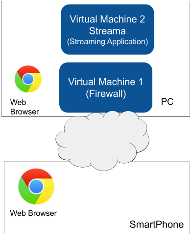

# Evaluación final - Servicios Telemáticos.

- Desarrollar las siguientes implementaciones. Estas deben ser sustentadas individualmente.
1. [2.0 Puntos (Funcionamiento + Sustentación)] SERVICIO + FIREWALL. Instalar el servidor de
streaming Streama protegido por Firewall como se muestra en la figura. Todas las solicitudes hacia el
servidor Streama deberán ser realizadas al firewall y no directamente al servicio configurado. El firewall
debe redirigir las peticiones al servicio.

- Compruebe el funcionamiento desde el navegador del anfitrión y del SmartPhone.
