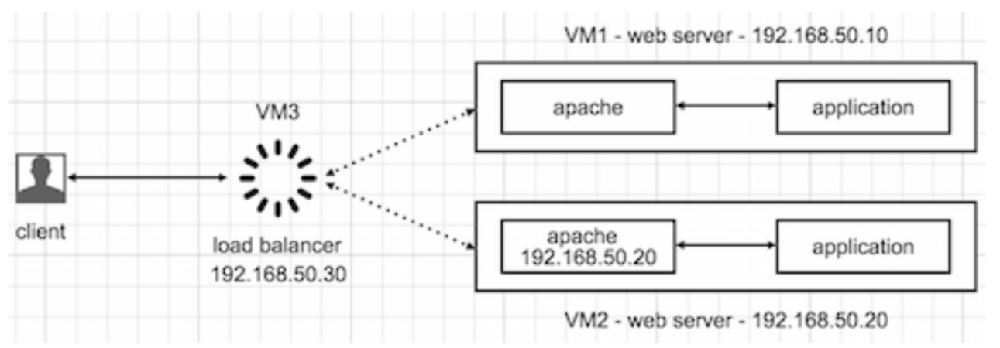
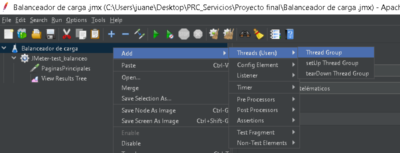
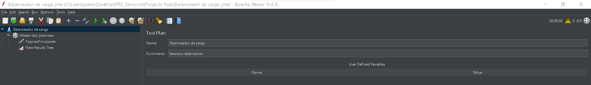
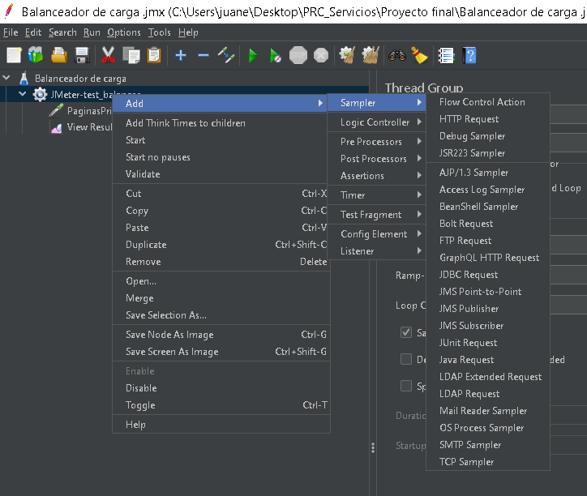
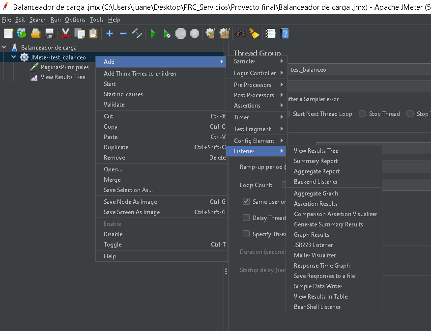
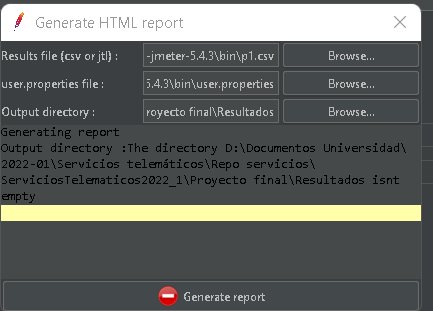
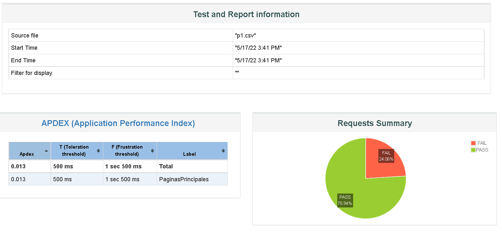
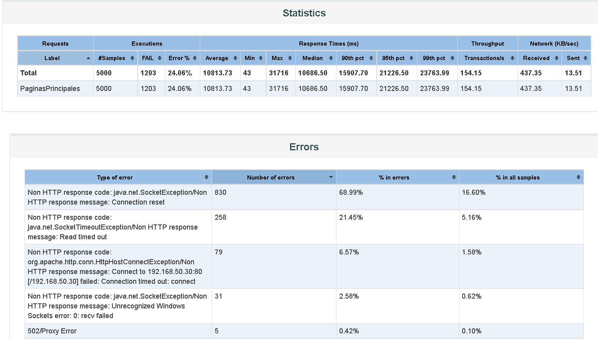

# Balanceador de carga de servidores web <Apache mod_proxy_balancer>

## Pruebas a realizar con JMeter:

1. Realice pruebas de carga variando los parámetros de las pruebas y analice
que sucede.

2. Agregue diferentes números de servidores web y verifique como responde el
sistema.

3. Explore las diferentes estadísticas que arroje el balanceador de carga. Tales
como numero de peticiones resueltas, taza de llegada de peticiones, porcentaje de fallas en la atención de peticiones, etc.

## Pasos para el desarrollo del proyecto.

1. Inicializar un nuevo ambiente de vagrant

```bash
vagrant init
```
2. Abrir el archivo Vagrantfile y modificar con la siguiente configuración:

```bash
Vagrant.configure("2") do |config|
if Vagrant.has_plugin?("vagrant-vbguest")
    config.vbguest.auto_update = false 
end
config.vm.define :servidor1 do |servidor1|
servidor1.vm.box = "bento/centos-7.9"
servidor1.vm.network :private_network, ip: "192.168.50.10"
servidor1.vm.hostname = "servidor1"
end
config.vm.define :servidor2 do |servidor2|
servidor2.vm.box = "bento/centos-7.9"
servidor2.vm.network :private_network, ip: "192.168.50.20"
servidor2.vm.hostname = "servidor2"
end
config.vm.define :loadbalancer do |loadbalancer|
loadbalancer.vm.box = "bento/centos-7.9"
loadbalancer.vm.network :private_network, ip: "192.168.50.30"
loadbalancer.vm.hostname = "loadbalancer"
end

end
```
Para este proyecto fue necesario utilizar estas tres máquinas para cumplir el siguiente esquema:


### ¿Qué función cumple cada máquina?
* La máquina loadbalancer actúa como el balanceador de carga entre las otras dos máquinas, es la encargada de decidir a cuál
de los dos servidores web le entrega las peticiones realizadas por el usuario a través del mismo, actuando como front-end.
* Las máquinas servidor1 y servidor2 actúan como servidores web que muestran una página con texto plano, es decir, actúan como el back-end para este proyecto.

3. El siguiente paso es levantar una por una las máquinas previamente creadas.

```bash
vagrant up 
vagrant ssh <nombre_maquina>
```

3.1 Para las máquinas Servidor 1 y Servidor 2 es necesario realizar la siguiente configuración:

```bash
yum install vim httpd
```
- Crear un archivo .html que contendrá texto plano y será la página principal para cada máquina:
```bash
sudo -i
vim /var/www/html/index.html
```
- Luego guardamos los cambios y reiniciamos el servicio:

```bash
Presionar la tecla ESC
:wq
service httpd restart
```
3.2. Para la máquina loadbalancer es necesario realizar la siguiente configuración:

```bash
sudo -i
yum install vim httpd
```
- Luego abrimos el archivo de configuración del servicio http, debemos agregar lo siguiente:

```bash
vim /etc/httpd/conf/httpd.conf
```
- Para utilizar el mod_proxy y el mod_proxy_http, agregamos las siguientes líneas:

```bash
LoadModule proxy_module modules/mod_proxy.so
LoadModule proxy_http_module modules/mod_proxy_http.so
```

- Para configurar el balanceo de carga entre los servidores back-end, es necesario agregar un VirtualHost como se muestra a continuación:

```bash
<VirtualHost *:80>
<Proxy balancer://clusterServicios>
BalancerMember http://192.168.50.10
BalancerMember http://192.168.50.20
ProxySet lbmethod=bytraffic
</Proxy>
ProxyPreserveHost On
ProxyPass "/" "balancer://clusterServicios/"
ProxyPassReverse "/" "balancer://clusterServicios/"
</VirtualHost>
```
- Ahora guardamos los cambios y reiniciamos el servicio:

```bash
Presionamos ESC
:wq
service httpd restart
```
## Configuración JMeter:

- Nota: Es necesario tener instalado el JDK en su versión 8 o posterior.

1. Descargamos el .zip de la siguiente dirección: https://dlcdn.apache.org//jmeter/binaries/apache-jmeter-5.4.3.zip
2. Copiamos el .zip a la raíz de nuestro disco local C o D.
3. Creamos una nueva carpeta llamada "JMeter"
4. Copiamos y descomprimimos el archivo .zip.
5. Vamos a la ruta: \JMeter\apache-jmeter-5.4.3\apache-jmeter-5.4.3\bin
6. Ejecutamos el archivo jmeter.bat

### Configuración de las pruebas:

- Damos un nombre al ambiente de prueba:


- Agregamos un grupo de hilos, aquí es donde vamos a configurar el número de usuarios, la intensidad y el nombre para esta configuración:


     - Agregamos sus configuraciones:
     
- Agregamos un sampler de tipo HttpRequest:

- Ahora debemos agregar la vista de resultados, que en este caso sería un Listener de tipo ViewResultsTree


### HTML Report

- Para generar todo un reporte de las pruebas realizadas en JMeter debemos agregar lo siguiente:
    * Listener: Simple Data Writer
    * Guardar como csv el listener ViewResultsTree
    * Tools > Generate HTML Report >
        - Results file (csv): Cargamos el csv que exportamos
        - User properties file: Está en la ruta de instalación del JMeter.
        - Output directory: Directorio donde deseamos almacenar el reporte.
    
    

- Obteniendo como resultado la siguiente información:


----------------------------------------------------------------



## Presentación del proyecto:
Adjunto en el repo.